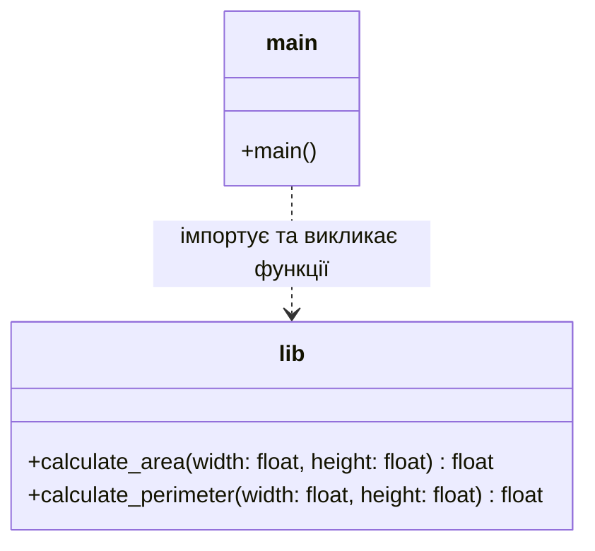

# Лабораторна робота №1

## UML Діаграма компонентів

Нижче наведена діаграма, яка показує внутрішню структуру Python-скрипту, його методи та зв’язки між ними:

```mermaid
classDiagram
    class main {
        +main()
    }
    
    class lib {
        +calculate_area(width: float, height: float) float
        +calculate_perimeter(width: float, height: float) float
    }
    
    main ..> lib : імпортує та викликає функції
```
