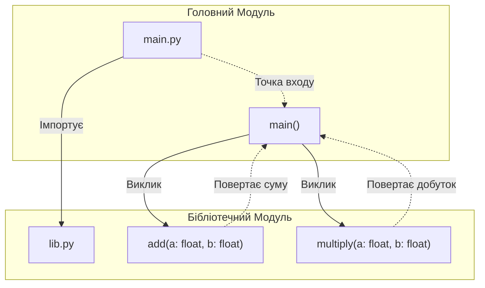

# Лабораторна робота №1

Це проста демонстраційна програма, написана мовою Python з використанням пакетного менеджера `uv`. 
Програма складається з двох модулів: головного файлу та бібліотеки з допоміжними функціями.

## Структура та зв'язки (UML / Component Diagram)

Нижче наведена Mermaid-діаграма, яка демонструє внутрішню структуру скрипту, його методи та зв'язки між ними (згідно з пунктом 7 завдання).

## Запуск
Для запуску програми використовуйте команду:
`uv run python src/laba1_c/main.py`
